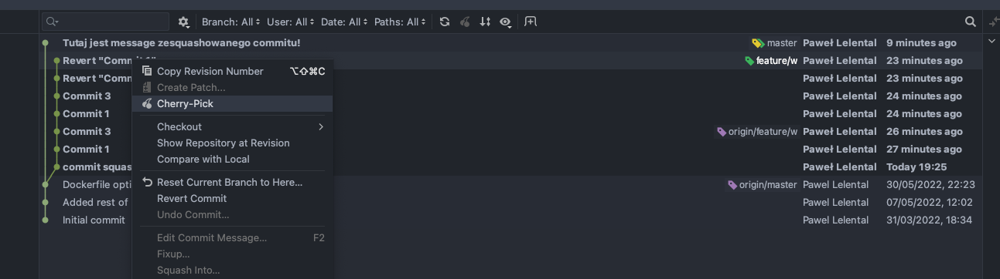
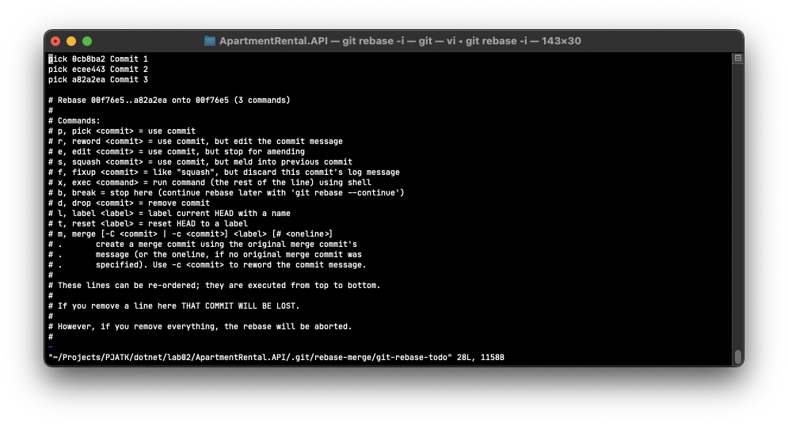
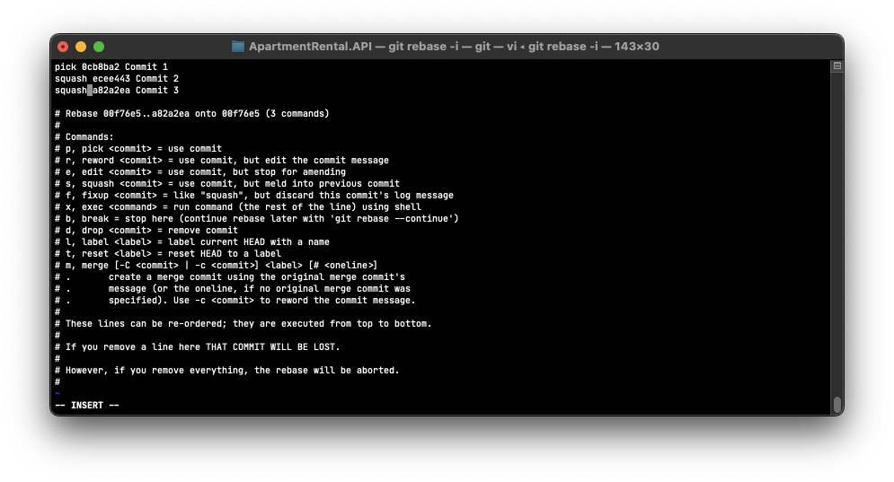
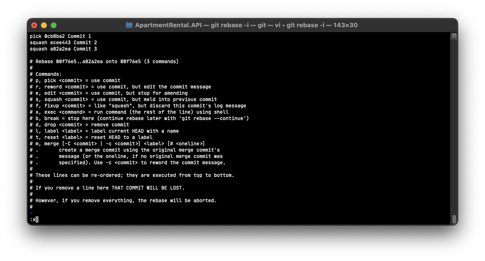
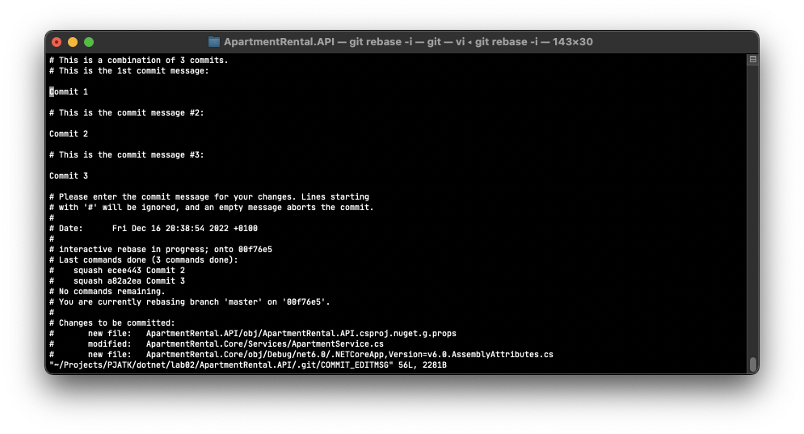
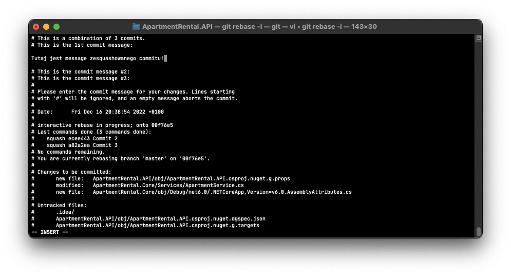

- fork
- markdown
- squash

```c++
public void main(int[] x){

}
```

# Nagłówek Główny
## Naglówek 2
### Nagłówek 3
#### Nagłówków 4

##### 5
###### 6

- lista 1
- lista 2

1. Lista p.1
2. Lista p.2
![TestZdjecia](data:image/webp;base64,UklGRi4LAABXRUJQVlA4ICILAACwOQCdASriAJsAPpFEnUolo6Khp1aZyLASCWdu3V6Lddshn0WT+cN9rkjPKbgHPH7RTAfwv05c8V4E/3MiKXSAmKka1msU8fjfVrysli4XJ+id8dyOA45nhNbpPXIbnHw45PjlAsVCbMMbnMNQ0tGceE0JKDDQrErqLPge3tZUxz23I0pnvMzIFWRqbTy9ZWgIAcE8d7ZOZZCc1f1anRYDzkBTEJxx9KJTNbSNxxkVZ7pEOOeEoCPvG5a4TCDDT7sABIEUiHfw52dSsbW7H1rzv05u3cAOPq7+PZ47lMsgZPxFNs2vLbDdDy2ArOQSoUXBs4sxWjnfmjIO4VzlTTkY0vY4iFD1IQCgoaEwO6RKyP+Nfi7F55bX7yiJbv+/EtKZfC5L4HrOeDBTzWg9hxEdpYWq9BwjSiNUyCZf2z3y/zIqegoPouC/WOcSwleaw9kI3M5bpnN7GtWgp0ImQzbhOqHOzgrpanV319ImutLYLUjmrBKG/9xy/n92jxIZFggOfxZWQPWzJpN1hEEPgZqPNznd0z0rKCbD9h3nV3LgLUr6aPW+YmgZ3O2ycs8NDS1se2wCRLmVtuDN1Ua8/RVOyLE0KcrzLAz2efejLYXnY/JIwktAAAD++raFLJq9wUjadee5oGY9DWnf5m8moXz3zAQEov3beCWRYlcmng/4pWM+b8MsNPKFVHdnxQsicDrFNUKYEjXb+jxqg+gMLr0vz4+4v0mqsOO2/p0wXXkorz9hxIpKVMGWQwWS6Gmwj9Va9Un+rK37B3vDDZ8s8l0eej7XN1jEJJBj06I4WVcBrLJ5rQnLOukGHj1/sBXBHNsE5d+cTPJBBXVU5RD78wp07oUoVMvZ+a07JbWijsTjfr0Tppr8Z5qqFhrnJEd5eexIiV5Jjv+8dlJSswByJPU27ig8YDGLS1IuClZSyYYZNCphQ/rjEuyY+1hpRh2VQxqM+tkewlOVfR3i9PXM1uQ6wyhqC0nR7lK3/Smpj2tHdly/fPhqkh2JRdarZUSCvhlBPgpWjTGoMbcoFcNi3Xc6aFQvHXzTp0yTFLVmxi6GiPU2rh3Cpc0YpdVTksKETbbHrp28BtiLEbyNLMvsk6wRx1x+VV+q4o2iVTAAmm++E9CP14XLiJiH52gd+DDUqyUeXPcwwsdzdlNaWw44ZC8vKSCCHvTBPSjJy8fz3KXlfmQt0BooegGKJ7V5W1SHRF2AptQI+V+QCAyxGnfPTIFSwjEVmMi7z50jRNdubFXsGvdkIcB5HuPo7EYqCOWm+I/aItc+IUdCi9/jcfzdjVUePMhGkJiT5d1ZNwzJuonks7x0yZEqo3ptNo1taXd+ZsmcrLZW6ByxgaqfAw/FjqAh6OjRez3XmXOTSy8bMf4s8zToxKG04uXjisOZWjC0wNL/x/q1xoKwqinQ2UIBrtjGa+75BI+WPH1hEJW6hB3Xzb9AAABDyCwKKdu7D6hlG+Wju/NAtt+RU4jtOoRStqLOJFQfUi2G2u9Ov92JwpalXbZq+J1ukK7qdeozspFsP3VGilkwfu/xe6rHhfNLWax+gKHSHlk6wERn2laKUJaaqmbjTWgx7/LGPjQiBq284brHFLXhVrnbl+kdzIw/rX/HSXCUwjHJoY+Cx3wjHx2c1EFAI4tTiV85WyIsItaDHk2V4FfCTHa2VCfM0zsTyw+yHlvhnWTLuxjreV3nB7DmRgCV3K1wJ0hqx04BPcn/6/jbD8+TEeT4m7fHwGk+M5wFyRNmL/Z0MrVt9RwSNj6lSej0Xki2dM+2xCYdJRBhfBaibo+mQWetk/9KnXmbJJJrGT5pFTrLElSeqvMMemV0uHk+T0MoXm8Vst6zXqbIsoxPA7lqtCYf/c/C4H45N4fNRpK9Xfff6C/6Wgn5/FYY6ABmriJNspy7sVgAplXoC5lcUxvojEfFRAsGpRXQ3I8tNSZhmuX2WRuqmkKW26+LTXUlp3kIw2zCe2B384AUFS5NCWP0GGhkQQWTVKkoAcY7vFDGTzo0w0cUVo0JZOo4hMf8NiYmn3PH7CpPOA7TK1V3vhIE1WDVfh2P1i5bZ8mahCjurzAav5L7x01KFoHjoqEXgyu7avhmYM1rdgl56ExF7DrK5FZHGkFGfvqtvY+1c3Kh3DglCOTbYOXusJIiRi+OWYdjurBfaKDLGaQitwSibZD3m2BP7goMT379ocgmLBgsi5gHnBv513E9D8IoOWzH8BlkAQtTaJP5ZrGkfZ+lxPMt5z1VaaZww2DsXOA8WqAEiic3AR9xovpTOum1R2QRgs+Lm2oITcQuCbmWyAuPcCQ4QR83q6tml0nC+uz2uy7Pi4UEe/DqEONaeJtx7SyoblljkWHo8DhrbXtyK2eKuhaEnM32oHW/x+w6AbOrpNy60hDxuEb7qIGHHqLrUWbhfN2SJiyNIDgsoullOFUx8b+k6ww9iQSRUHKwndAxKBH9Ng+ZtPS8nDiXvsMNvk/rxDXOC+njkEUsxgsTrVRJ8ymJADco9/xfr8rrUWcXP9OQhwNSK0cKQC+hQ/6tc/ZGMJYKYfDeOzrxnzTcUo68R66s93+cIWGdNsu9cGs8/C7m8UUvAIB0mSaeRNvr3EGiIXWQehCd8wabr6SgCpqQGyY9i40GtNwsPeiv701QQBi+YXrpK7r4fQQt+TBlX7Geql7xXKALFdk/yw0xuV4bVlOhbiX4KpoMjIE1AodQhRF29ohtsbDdecgVN4Y9F/+DR+KQqvIlVozBYb18E9KjHe5igUYnhG7J7hYkRkNreIawW4wYgsulJK/zntqDdcm/ikOCJ6YNhzDlsY2LTsSV22Tk/FokFCm3v727LecsS3zJCWoS4ldsuT2hwfa9xEqAHP9LS4FfSxNlE2ENDksgZQH2AB1uIQsN36X7tu24AuoXJ8QdiYWdN+aM40xUcexwStyHP6wClnZihZTBkAlkc+uy6AJ9FHkAspObDQteVKfCqkydRP1aPkzL8yhCwrZdD/vYyypsINwUZmR5XLlLw0EfIsMvyizJLn0cm5j1LaOYkr/xLEsy3nzfFzFqXwtZpZxgm7BM5gTt1eEoOFQHTcq8m9d4hCd5TMZqcMgQXLNwcPjs+zmw3wLwy/7y79aW8s75LtipHGOYfsVR+0VG112ZriWTeKW4uE8AJVrzxy5sk8tBkz7xfCFewT0kEBR1ca8ZxVqT/o3+IZcDUs0qE6RfHxCBsdRsTRxi5SYgU/V13IxUgvxYnJ87GScwo9IHGPNggo57PbeJDAukrpkgPkz8EBimCVoNQEIPhKd4xjxtU9nlnvIPbM6U9x8l6i4Svf6KZaT0+eK4qg0Xg6dQQENCR5zbUi2XKYnaMYbPl7jyaCLC1KJ7BIWcpV8SeV7ey51I0e9hSdrDGUAduQ9j5pL+05okBdEzNmHuZoby3wUSYZB1oGSx+X/9cyzoW5ka/Ow+2UGG9UFEFLgotJmHRAa5xS3H3hiD0zXVpRMACptSkdeaVCIGb38eAS7SnnkWm/sB9h5eOZRhLhHZHlzris+a5dvPf/s+pEBeEX3f2UWkqjBZPhoAEMJWI4gfhBefTQS2WQ2PfX8RHQxzKUXSv8lcszbckLk2EwWiOK+4zdTs0zLy6VwcPQUxB8yP8Z1UjO42H8vCx9X2uAzvTF1MEV7Oy1hzA/COMe2+FVY0qjoqiftlZEHq9/kos0R3Ler0mAlYdjWv4uJStGjhwyn6s2U/LQSLBF0r1ZDvnKM3WeCL7q+4gRIghLl0hcp3IAKn8qSUh9L5+L44Ssx6gdEm+1Nlx4Jh2lDJL4QxQOOAAAA=)


[Lik](https://git-scm.com/doc)

```c++
public void main(args[] arg){
 int i = 0;
}
```
# UKOS laboratoria - praca z repozytorium część 2 i 3

## Wprowadzenie
### Fork
Fork to nowe repozytorium, które dzieli kod i ustawienia widoczności z oryginalnym repozytorium. Operacja kopiuje główne repozytorium na nasze główne konto. Forka można dokonać wchodząć na główną stronę repozytorium, które chcemy skopiować, a nastepnię klikając w zielony przycisk po prawej stronie z napisem `Fork`.
### Markdown
Markdown to lekki język znaczników ze składnią formatowania zwykłego tekstu. Pliki w języku MarkDown są standardem w branży do tworzenia tzw. plików Readme, które służą do opisania oraz stworzenia instrukcji do naszego repozytorium, bądź projektu. \
Podstawy języka markdown dostępne są pod danym linkiem: [Markdown Syntax](https://www.markdownguide.org/basic-syntax/).\
Podczas zajęć potrzebne będzie użycie takich znaczników jak
   - Headings `#`
   - Lista `-`
   - Link do obrazka ``
   - formatowanie jako "kod" \` <kod> \` 
### Squash
Squash jest sposobem na przepisanie historii commitów; ta akcja pomaga oczyścić i uprościć historię commitów przed podzieleniem się swoją pracą z członkami zespołu. Squash commitów oznacza, że bierzesz zmiany z jednego commitu i dodajesz je do commitu macierzystego.
   
Aby dokonac squasha w terminalu, należy użyć interkatywnej funkcji rebase za pomocą komendy `git rebase -i`. Komenda powoduje otwarcie listy z historią commitów w edytorze VIM. Aby rozpocząć edycje tekstu za kursorem należy naciśnąć przycisk `i` na klawiaturze. Wówczas należy wybrać z listy commitów te które, powinny zostać zesquashowane. 

Aby tego dokanać, należy przy odpowiednich commitach zamienić słowo `pick` na `squash` bądź `s`.

By wyjść z trybu edycji należy wciśnąć przycisk `esc` na klawiaturze. Aby zapisać zmiany należy dokonać poniższej komnbinacji znaków na klawiaturze: `:x`.

Następnym oknem po zapisie, jest okno wyboru wiadomości commitów.

Za pomocą wcześniej podanych kombinacji klawiszy, należy usunąć wiadomości dla ze squashowanych commitów oraz zedytować pierwszy commit message. 
   
### Cherry-pick
Cherry-pick to zaawansowane polecenie, które umożliwia wybranie dowolnego commita Git przez referencję i dołączenie go do bieżącego roboczego wskaźnika HEAD. Operacja „cherry pick” polega na wybraniu commita z gałęzi i dołączeniu go do innej gałęzi. Polecenie git cherry-pick może być przydatnym narzędziem do cofania zmian. Załóżmy na przykład, że commit zostanie przypadkowo wprowadzony w niewłaściwej gałęzi. Możesz przełączyć się do właściwej gałęzi i za pomocą operacji „cherry pick” wstawić commit tam, gdzie powinien się znaleźć. - By Atlassian.

Test
Test2

Operacje prosto można również wykonać za pomocą graficznych interejsów użytkownika dla Gita takich jak SourceTree, czy wbudowane narzędzia w IDE. W najpopularniejszych rozwiązaniach często wystarczy w historii commitów wybrać interesujący nas commit za pomocą prawego przyciska myszy oraz kliknąć polecenie `cherry-pick`.

   
      
## Zadania   
1. Wykonaj forka bieżącego repozytorium do swojego konta na Githubie
2. Z clonuj repozytorium na lokalną maszynę
3. Stwórz brancha `feature/<twoj_numer_indeksu>/markdown`
4. Stwórz plik `AboutMe.md` i uzupełnij go. Przejrzyj najpierw skladnie pliku `README.md`. Plik `AboutMe.md` powinien zawierać takie dane jak (każdy z podpunktów powinien zostać wykonany jako osobny commit):
   - Krótki opis przedstawiający kim jesteś
   - Listę Twoich hobby
   - Obraz z kotem
   - Link do twojego Githuba
5. Dokument powinien być odpowiednio sformatowany
   - Każdy z punktów powinien mieć swój własny heading
   - Lista z hobby powinna zostać stworzona jako unordered list
   - Obrazek powinien być po prostu linkiem do obrazku z internetu
   - Link do GitHuba powinien zostać sformatowany jako "kod"
7. Za pomocą komendy `git rebase -i` w konsoli dokonaj squasha trzech commitów. Zesquashowany commit powinien mieć następującą nazwę `squashed commits <numder indeksu> - added AboutMe.md file`
9. Wypushuj zmiany na remote
10. Stwórz PR i poproś prowadzącego. Po pomyślnej weryfikacji zmerguj PR
11. Z głównego brancha stwórz nowego brancha o nazwie `feature/<twoj_numer_indeksu>/gui`
12. Z głównego brancha stwórz nowego brancha o nazwie `feature/<twoj_numer_indeksu>/cherrypick`
13. Wróć do głównego brancha i wpliku AboutMe.md dodaj jeden znak specjalny do pierwszej linijki i wypushuj zmiany
14. Wróć do brancha `feature/<twoj_numer_indeksu>/gui`
15. Otwórz repozytorium w jednym z narzędzi, który umożliwia steowanie gitem za pomocą graficznego interfejsu użytkownika (Jetbrains IDEs / Sourcetree / Fork / VS Code itd..)
16. Zrób zmiany w pliku `AboutMe.md`, dodaj zdanie "lorem ipsum" w pierwszej linijce
17. Zacommituj i wypushuj zmiany za pomocą graficznego interfejsu użytkownika
18. Za pomocą GUI zrób rebase, rozwiąż konflikty oraz wypushuj rozwiązane konflikty na remote
19. Stwórz PullRequesta i poproś prowadzącego. Po pomyślnej weryfikacji zmerguj PR.
20. Wróc do brancha `feature/<twoj_numer_indeksu>/cherrypick`
21. Zrób cherry-picka ostatniego commita z głównego brancha
22. Wypushuj zmiany, stwórz PR i poproś prowadzącego


Testuje gita